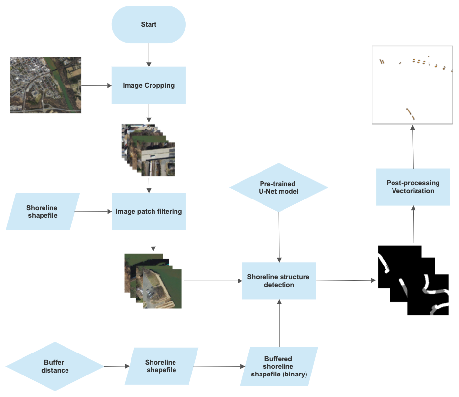
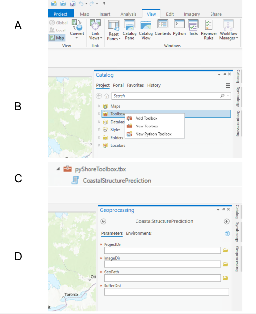

## pyShore

pyShore is an open-source toolkit for mapping shoreline structures with a deep learning framework pre-trained on high-resolution orthoimagery. The following flowchart outlines the use of this tool in ArcGIS Pro:

### How to add the toolkit to ArcGIS Pro
1. Clone the pyShore GitHub repository, or save the pyShoreArcGIS and weights folder in your defined project working directory.
2. In ArcGIS Pro, turn on Catalog Pane under the "View" tab (section A in chart below).
3. Go to "Catalog" and add the pyShore toolbox by clicking "Add Toolbox" (section B). 
4. The "CoastalStructurePrediction" toolkit is added to your environment and ready to use (sections C and D).

### How to run the toolbox
There are four inputs required to run the toolkit: 

**ProjectDir**: a working folder in which to save all processing and results data.

**ImageDir**: a user defined folder with all source imagery in a georeferenced (geoTiff) format. 

**GeoPath**: a user defined single geometry file (i.e., shapefile) that defines the geographic locations of shoreline within the provided imagery.

**BufferDist**: a user defined distance to buffer shorelines, the distance from the shoreline that should be extracted from the imagery to serve as the target for classification.

### Requirements for model training
- torch: 1.12.0
- cuda: 11.2
- python: 3.7.10

### Requirements for ArcGIS prediction
ArcGIS Pro 2.3.0

Your ArcGIS Pro environment should have the deep learning framework set up. To set up your environment, please follow: https://pro.arcgis.com/en/pro-app/2.6/tool-reference/image-analyst/pdf/deep_learning_install.pdf

You will also need the geopandas and rasterio libraries. Some open-source Python libraries are not automatically installed in ArcGIS Pro. To install geopandas, activate the virtual environment you created from above tutorial and run:
$conda install geopandas libtiff=4.0.10 rasterio can be installed through conda or pip.

### Citation: 
Lv Z., Nunez K., Brewer E., Runfola D. pyShore: A deep learning toolkit for shoreline structure mapping with high-resolution orthographic imagery and convolutional neural networks. Computers & Geosciences 171, 105296. doi: https://doi.org/10.1016/j.cageo.2022.105296.
BibTex citation: 
@article{LV2023,
title = {pyShore: A deep learning toolkit for shoreline structure mapping with high-resolution orthographic imagery and convolutional neural networks},
journal = {Computers & Geosciences},
volume = {171},
pages = {105296},
year = {2023},
issn = {0098-3004},
doi = {https://doi.org/10.1016/j.cageo.2022.105296},
url = {https://www.sciencedirect.com/science/article/pii/S009830042200245X},
author = {Zhonghui Lv and Karinna Nunez and Ethan Brewer and Dan Runfola},
keywords = {Deep learning, Coastal management, Remote sensing, Semantic segmentation}
}

